# MPI

## Содержание
- [MPI](#mpi)
  - [Содержание](#содержание)
  - [Сборка и запуск](#сборка-и-запуск)
    - [Задание 1](#задание-1)
    - [Задание 2](#задание-2)
    - [Задание 3](#задание-3)
  - [Задание 1 — Монте‑Карло для π](#задание-1--монтекарло-для-π)
  - [Задание 2 — y = A·x: строки / столбцы / блоки](#задание-2--y--ax-строки--столбцы--блоки)
  - [Задание 3 — Матричное умножение: алгоритм Кэннона](#задание-3--матричное-умножение-алгоритм-кэннона)
  - [Результаты и выводы](#результаты-и-выводы)

## Сборка и запуск

### Задание 1
```bash
mpicc src/task1/task1.c -o src/task1/task1
mpiexec -np 4 src/task1/task1 10000000

# батч‑прогон (из комментариев):
for p in 2 4 8; do
  for n in 1000000 5000000 10000000 50000000 100000000; do
    echo "Run: P=$p, N=$n"
    mpiexec -np "$p" src/task1/task1 "$n"
  done
done
```

### Задание 2
```bash
mpicc -O3 src/task2/task2.c -o src/task2/task2

# примеры:
mpirun -np 4 src/task2/task2 4096 row
mpirun -np 4 src/task2/task2 4096 col
mpirun -np 4 src/task2/task2 4096 block

# батч‑прогон (из комментариев):
for algo in row col; do
  for p in 2 4 8; do
    for N in 1024 2048 4096 8192; do
      echo "algo=$algo P=$p N=$N"
      mpiexec -np "$p" src/task2/task2 "$N" "$algo"
    done
  done
done

# блоковая схема (пример из комментариев):
for p in 4; do
  for N in 1024 2048 4096 8192; do
    echo "algo=block P=$p N=$N"
    mpiexec -np "$p" src/task2/task2 "$N" block
  done
done
```

### Задание 3
```bash
mpicc -O3 src/task3/task3.c -o src/task3/task3

# N берётся из argv[1], число процессов p должно быть квадратом (4, 9, 16, ...).
mpirun -np 16 src/task3/task3 1024
```

## Задание 1 — Монте‑Карло для π
По методичке: из квадрата стороны 2 выбираем случайные точки и считаем долю попаданий в единичную окружность; отношение стремится к π/4. Реализована параллельная версия и построены графики времени, ускорения, эффективности и погрешности.

**Код**: [`src/task1/task1.c`](src/task1/task1.c)  
**CSV**: [`src/task1/results.csv`](src/task1/results.csv)

**Графики**:
- 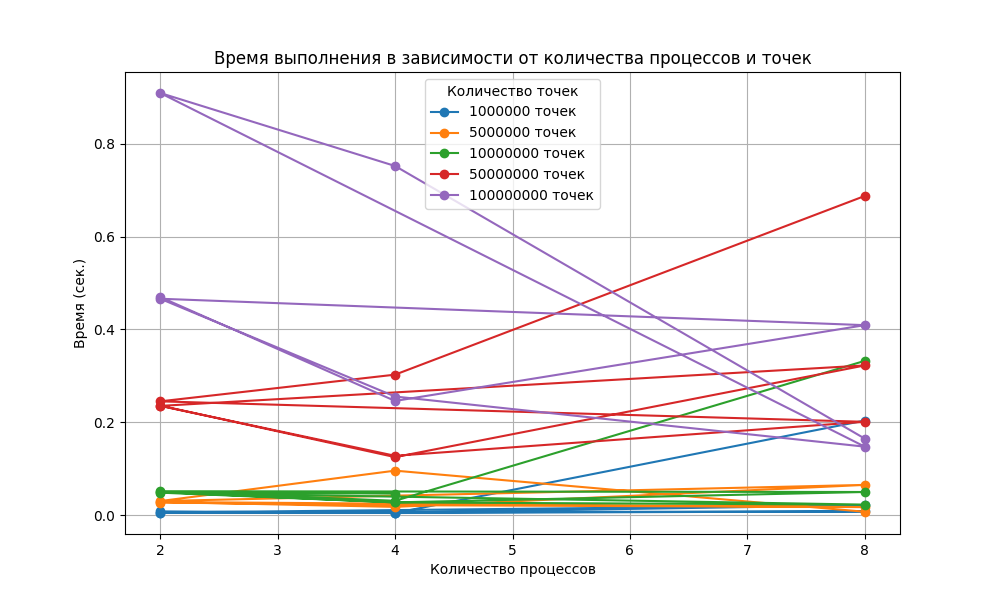
- 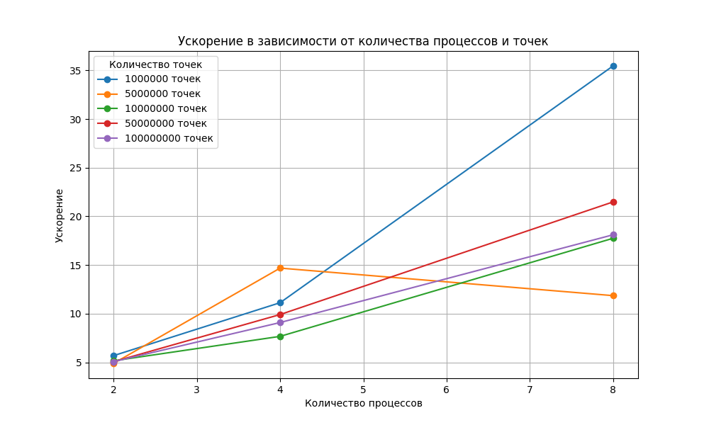
- 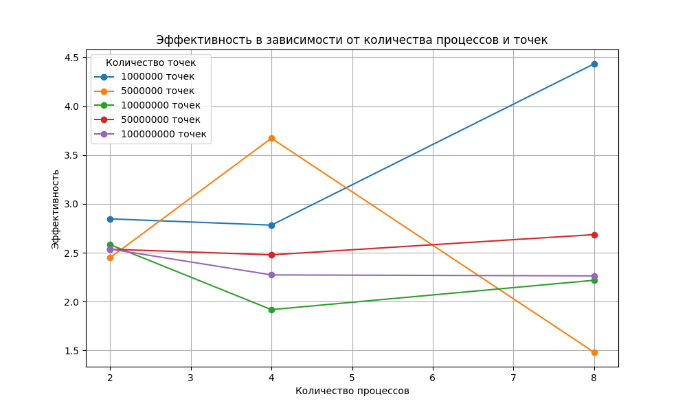
- 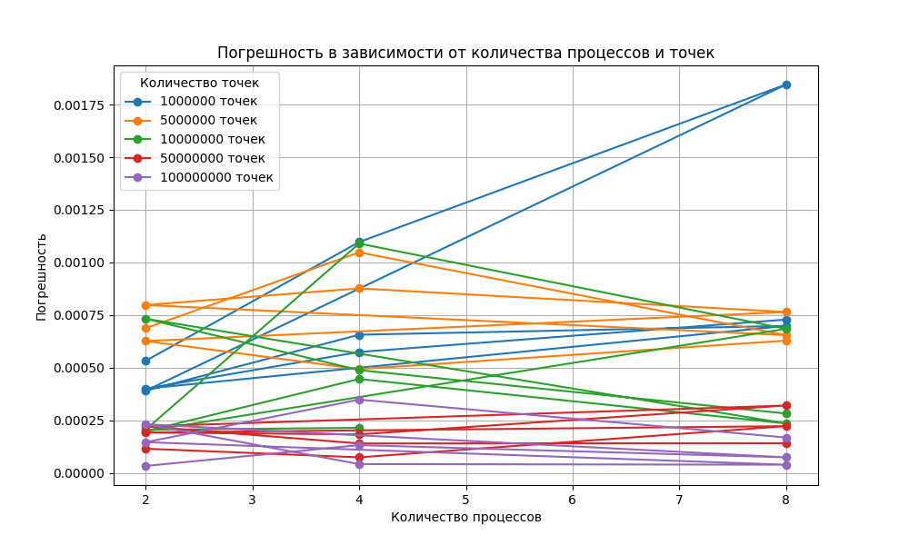

## Задание 2 — y = A·x: строки / столбцы / блоки
Сравниваются три схемы распараллеливания умножения матрицы на вектор: разбиение по **строкам**, по **столбцам** и по **блокам**. Выполнены замеры для разных N и числа процессов p. Построены графики времени, ускорения, эффективности, а также **сравнительные** графики между алгоритмами.

**Код**: [`src/task2/task2.c`](src/task2/task2.c)  
**CSV**: [`src/task2/results.csv`](src/task2/results.csv)

**Графики по p**:
- 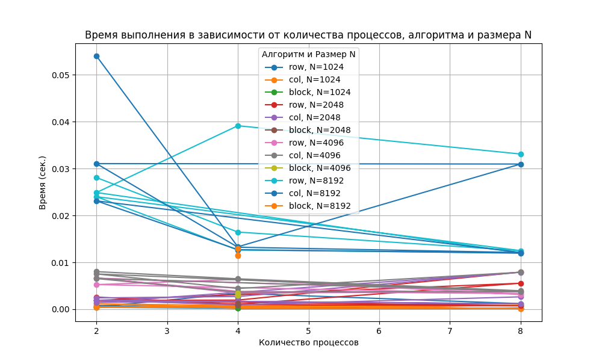
- 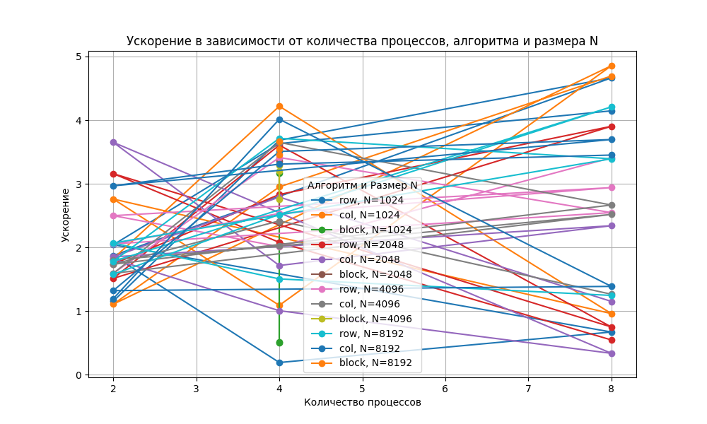
- 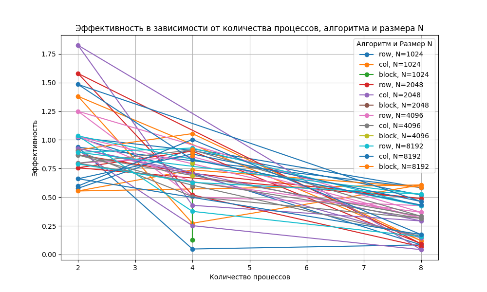

**Сравнение алгоритмов**:
- 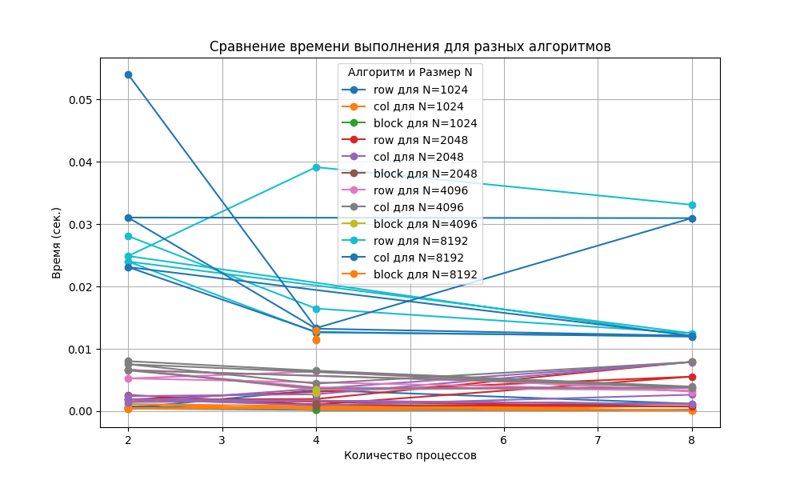
- 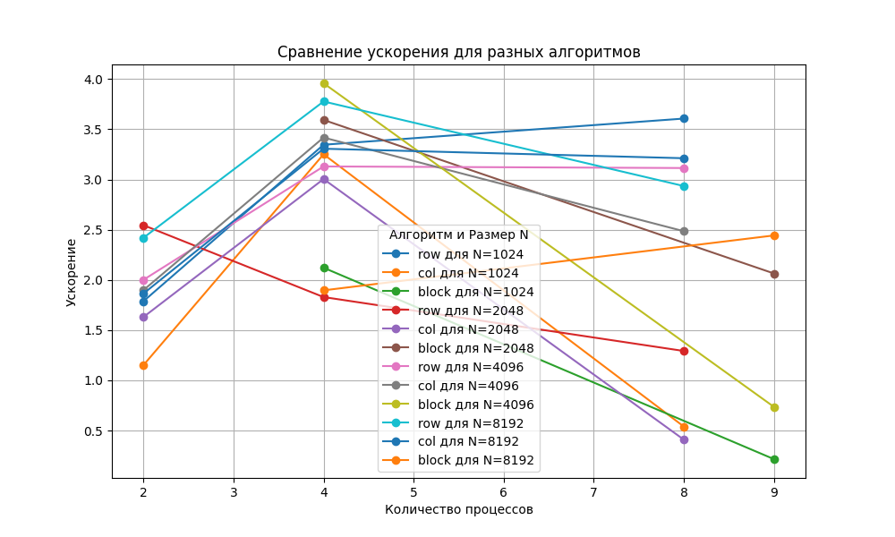
- 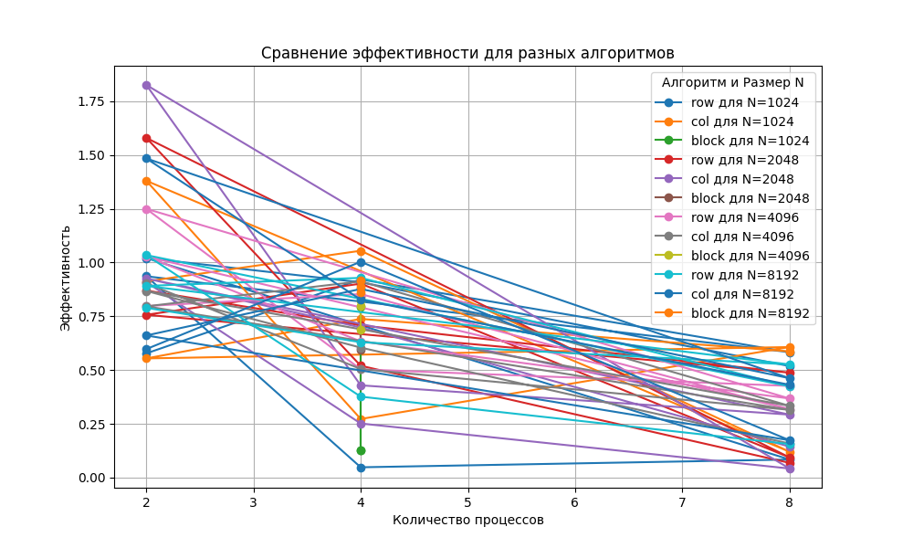

## Задание 3 — Матричное умножение: алгоритм Кэннона
Реализовано блочное матричное умножение по алгоритму **Кэннона**. Проведены замеры T_p и рассчитаны S_p, E_p в зависимости от размера задачи и числа процессов. Построены отдельные и сравнительные графики.

**Код**: [`src/task3/task3.c`](src/task3/task3.c)  
**CSV**: [`src/task3/results.csv`](src/task3/results.csv)

**Графики**:
- 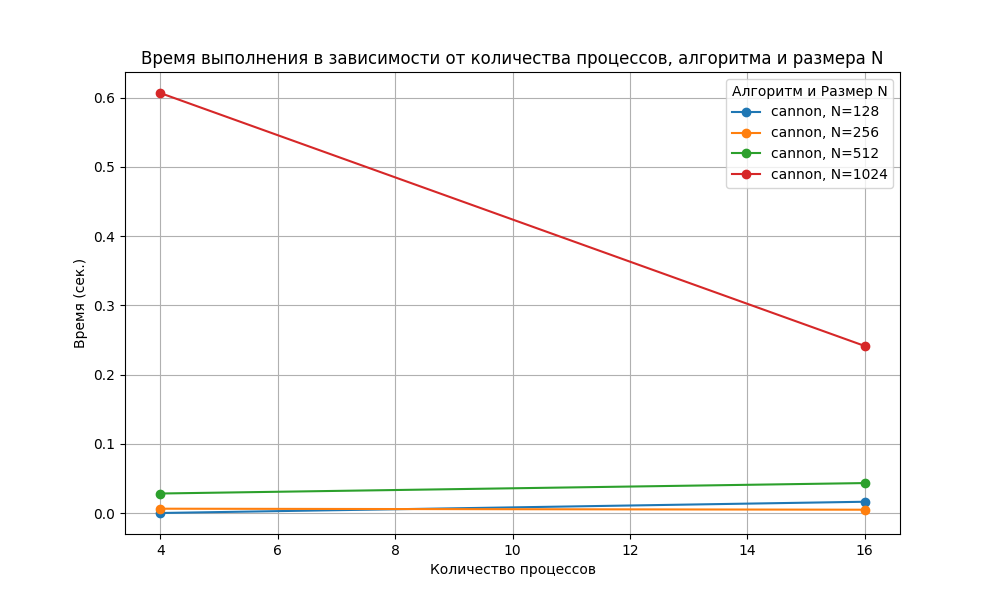
- 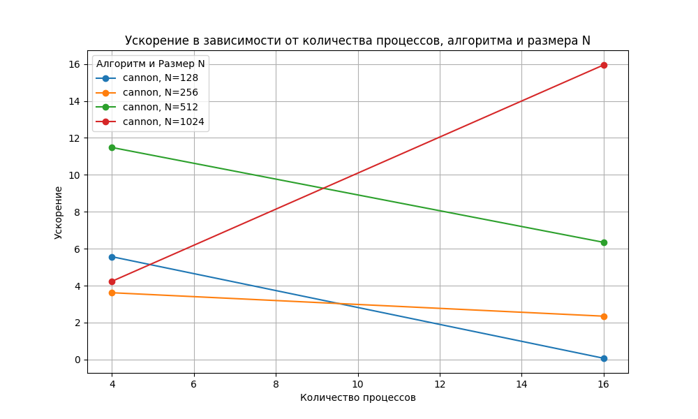
- 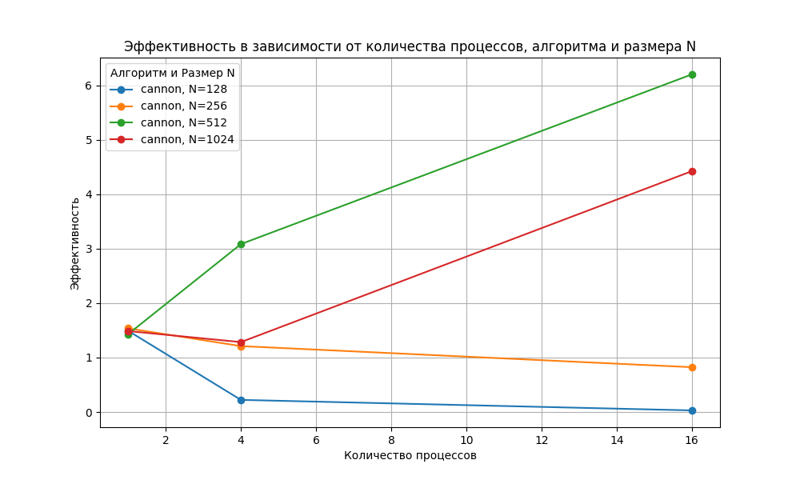
- 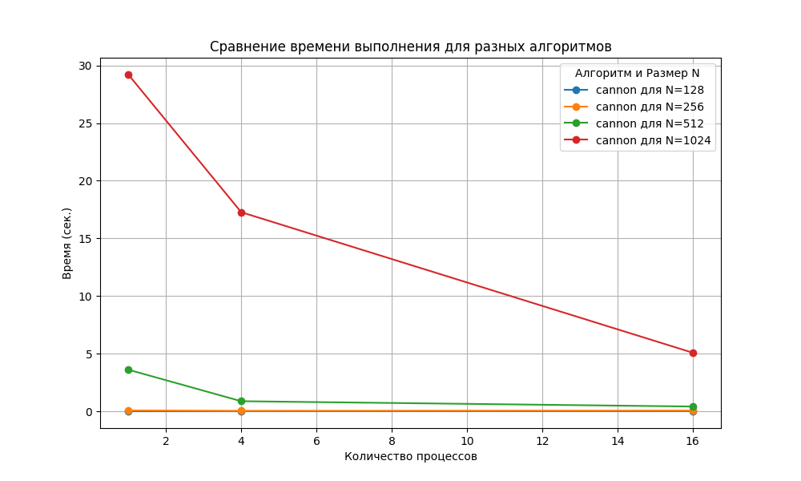
- 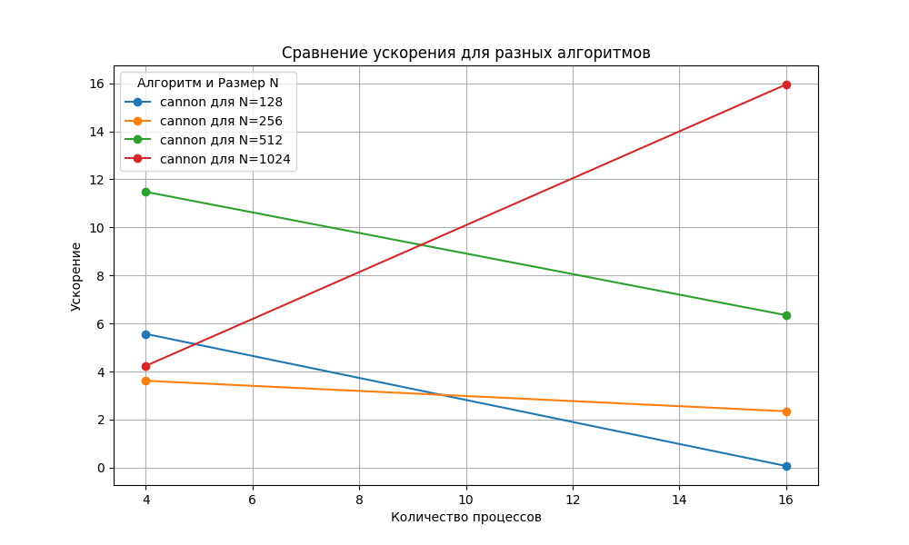
- 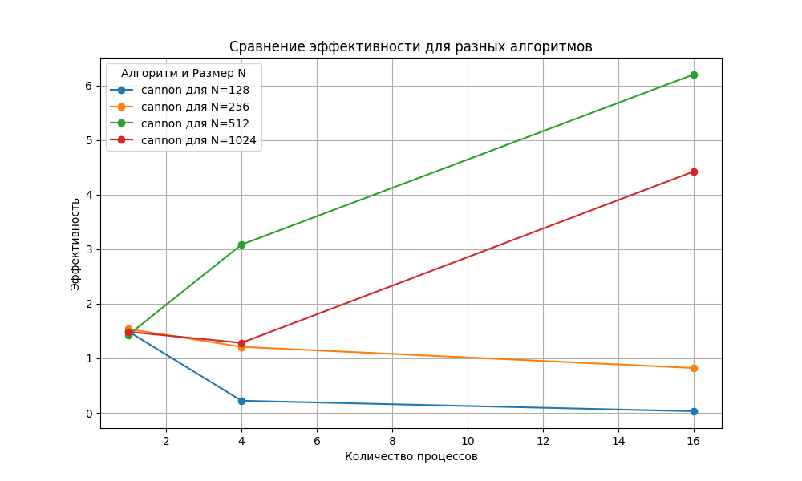


## Результаты и выводы

- **Задание 1 (π, Монте‑Карло):** лучшая точка по CSV — N=100000000, p=8: время T=0.165 с, ускорение S≈73.35, эффективность E≈9.17. По средним: T̄(p=2)=0.188 с, T̄(p=4)=0.131 с, T̄(p=8)=0.178 с — минимальное среднее время на p=4. Средняя погрешность |π̂−π|≈0.000454 и убывает при росте N.
- **Задание 2 (y=A·x):** максимум ускорения показала **col** при N=1024, p=8: S≈4.86, E≈0.61. В среднем по p: S̄_row(p=8)≈2.70, S̄_col(p=8)≈2.44, для **block** данные есть для p=4: S̄_block(p=4)≈2.77. Эффективность снижается с ростом p, что ожидаемо из‑за коммуникаций.
- **Задание 3 (Кэннон):** лучшая точка — N=512, p=16: T=0.420 с, S≈99.25, E≈6.20. В среднем S̄(p=1)≈1.49 → S̄(p=4)≈5.80 → S̄(p=16)≈45.93 — рост ускорения подтверждает масштабируемость при квадратном числе процессов.
